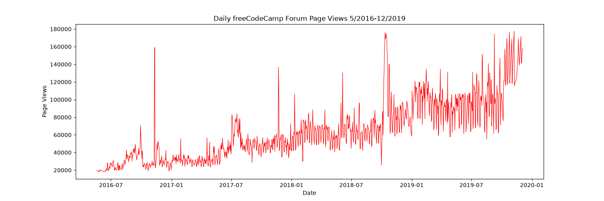
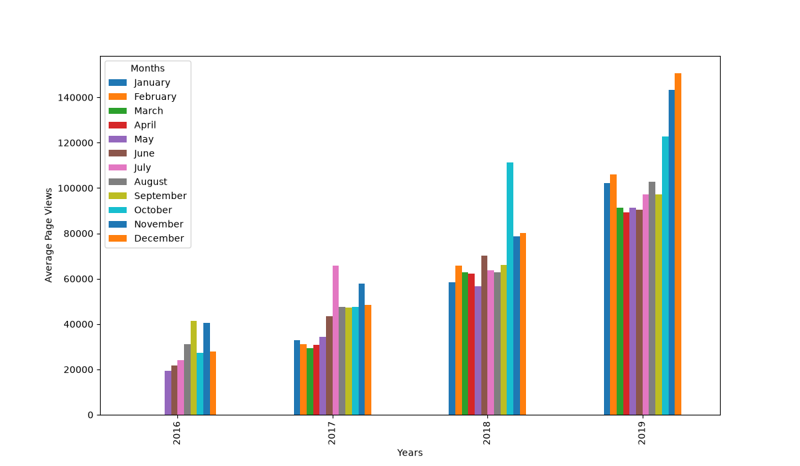
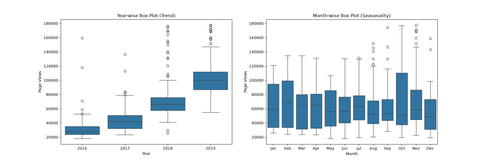

# Page View Time Series Visualizer

A data visualization project built with Python

## Output Screenshots

### 1. Line Chart


> Shows daily page views over the entire date range, highlighting the overall upward growth trend from 2016 to 2019.

---

### 2. Bar Chart


> Displays average daily page views for each month grouped by year. Each cluster represents a year, and each colored bar represents a month.

---

### 3. Box Plots


> **Left:** Year-wise distribution showing the upward trend over time.  
> **Right:** Month-wise distribution revealing seasonal traffic patterns.

---

## Tech Stack

- **Python 3**
- **Pandas** — data loading and manipulation
- **Matplotlib** — line and bar charts
- **Seaborn** — box plots

---

## Project Structure

```
page-view-visualizer/
├── main.py                     # Runs the visualizations and tests
├── time_series_visualizer.py   # Core logic and chart functions
├── test_module.py              # Unit tests
├── fcc-forum-pageviews.csv     # Dataset
├── line_plot.png               # Output: line chart
├── bar_plot.png                # Output: bar chart
├── box_plot.png                # Output: box plots
└── README.md
```

---

## Setup & Installation

1. **Clone the repository**
```bash
git clone https://github.com/your-username/page-view-visualizer.git
cd page-view-visualizer
```

2. **Install dependencies**
```bash
pip install pandas matplotlib seaborn
```

3. **Run the project**
```bash
python main.py
```

---

## How It Works

### Data Cleaning
Days in the top 2.5% and bottom 2.5% of page views are removed to eliminate outliers before visualization.

```python
df = df[
    (df["value"] >= df["value"].quantile(0.025)) &
    (df["value"] <= df["value"].quantile(0.975))
]
```

### Functions
| Function | Chart Type | Description |
|---|---|---|
| `draw_line_plot()` | Line Chart | Daily page views over time |
| `draw_bar_plot()` | Bar Chart | Monthly averages grouped by year |
| `draw_box_plot()` | Box Plots | Year-wise and month-wise distributions |

---

## Dataset

The dataset contains daily page view counts for the freeCodeCamp.org forum from **May 9, 2016** to **December 3, 2019**.

- Total rows after cleaning: **1,238**

---

## Test Results

```
......
----------------------------------------------------------------------
Ran 6 tests in 0.5s

OK
```

---

## License

This project is open source and available under the [MIT License](LICENSE).

---


